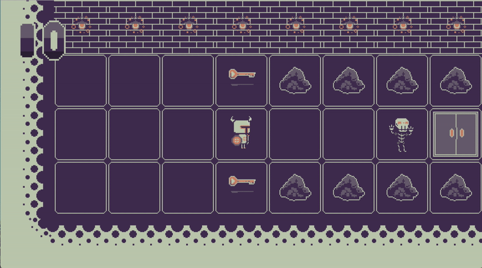
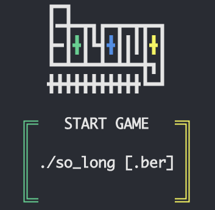

# So Long [42 KUALA LUMPUR]

And thanks for all the fish! 👻



## Table of Contents

- [Project Objective](#project-objective)
- [Installation](#installation)
- [Usage](#usage)
- [Game Setup](#game-setup)

### Project Objective

This project is a very small 2D game. Its purpose is to make you work with textures, sprites, and some other very basic gameplay elements.

### Installation

Supported platform: `MacOS`, `Linux`, `Windows (WSL / WSL2)`

- `42 Students`

If you are using a MacOS computer from 42, the Minilibx(MLX) should already be installed on your mac. So, just clone the project and run `make`. Read more on [# Usage](#usage) to learn how to run the program.

```shell
git clone https://github.com/Ricky0625/so_long.git
cd so_long
make
```

- `Linux` or `Windows (WSL / WSL2)`

In order to run this program on a Linux/Windows machine, you'll have to install the Minilibx library manually. The official documentation of Minilibx already has a comprehensive installation guide, so please refer to [this](https://harm-smits.github.io/42docs/libs/minilibx/getting_started.html#compilation-on-linux) for more details.

Before you proceed, please make sure that you have cloned the `MLX Linux` version somewhere in your machine. If not, please refer to the link above.

> Please rename your "MLX Linux" folder to mlx_linux

Now, what you need to do is clone this project on your machine and move the `MLX Linux` folder into the project.

```shell
git clone https://github.com/Ricky0625/so_long.git
mv [path_to_mlx_linux] [path_to_so_long]
cd so_long
make -C mlx_linux
make all
```

If you're able to run the commands above without any error and able to see this output in your command line. Congrats, the installation is successful!



- `MacOS`

For MacOS users, if you're not using a mac from 42, you are required to install the Minilibx library manually. Please follow [this](https://harm-smits.github.io/42docs/libs/minilibx/getting_started.html#compilation-on-macos), to install the library.

Before you proceed, please make sure that you have cloned the `MLX MacOS` version somewhere in your machine. If not, please refer to the link above.

> Please rename your "MLX MacOS" folder to mlx

Now, what you need to do is clone this project on your machine and move the `MLX Linux` folder into the project.

```shell
git clone https://github.com/Ricky0625/so_long.git
mv [path_to_mlx_macos] [path_to_so_long]
cd so_long
make -C mlx
make all
```

If you're able to run the commands above without any error and able to see this output in your command line. Congrats, the installation is successful!


### Usage

Read this section to learn more about how to run the game and have fun!

| Command | Description |
| :------ | :---------- |
| `make` or `make all`  | Compile the program |
| `make re` | Re-compile the program |
| `make clean` | Clean the object (*.o) files |
| `make fclean` | Run `make clean` and remove the so_long executable |
| `make checkall` | Run `norminette` on the project folder. Only works if you have `norminette` installed on your machine. |
| ./so_long map_name.ber | To run the game, run `make` or `make re` first, and run this command. It's "./so_long" follow with a file name that ends with `.ber` file extension |

There are some playable maps in the `maps` folder. Feel free to try them out. You also can create your own map to have fun but to do so, please go to the [Game Setup](#game-setup) section to learn how to properly create a valid map.

### Game Setup

The following section will introduce you the available characters/entities and some rules of the game.

#### Characters

These are the accepted characters in a map.

| Character in map | Description |
| :----: | :---- |
| `P` | Player. Scare of skeletons, will die if touch them. |
| `C` | Collectibles / Keys |
| `E` | Exit |
| `1` | Walls / Rocks |
| `G` | Ghost, the skeletons killer. |
| `M` | Skeletons, the enemy. Scare of ghost. |
| `0` | Floor / Blank space |

#### Rules for creating a valid map

These are the rules that you need to follow in order to create a playable map.

1. **Basic setup**

    - There must be **ONLY ONE** player.
    - There must be **AT LEAST ONE** collectible.
    - There must be **ONLY ONE**.
    - The map must be in a **RECTANGULAR-LIKE** shape.
    - The map must **ENCLOSED** by the wall (`1`).
    - The walls must **ONLY BE CONSTRUCTED USING `1`**.
    - Make sure that the player should **BE ABLE TO COLLECT ALL THE KEYS**.
    - Make sure that the player **CAN GET TO THE EXIT**.
    - **ONLY THE ACCEPTED CHARACTERS ARE ALLOWED**. Check [this](#characters) for more details.
    - The map should end with this extension: **.ber**. (As long as the file ends with .ber)

2. **Advanced setup**

    - **ALL THE BASIC SETUP RULES WILL ALSO APPLIED HERE**.
    - If there's a skeleton or more, the game should have **ONE GHOST**.
    - There must be **ONLY ONE** ghost.
    - You can design a map where the skeletons blocked the way of the player. But, the player should **BE ABLE TO REACH THE GHOST**. Otherwise, it's not playable.

You can check the maps in the `maps` folder to see some examples.

---

Have fun! I hope you enjoy playing the game!

By *Ricky Wong (wricky-t on intra)*, on 24th Nov 2022.
